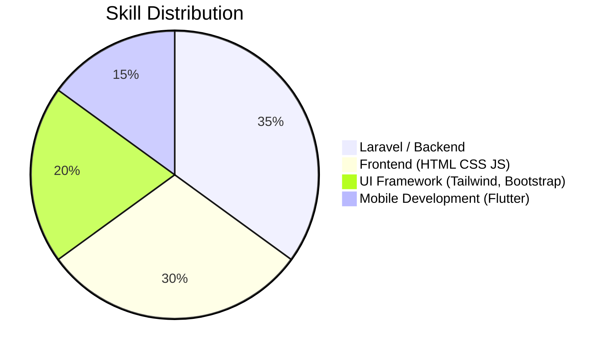
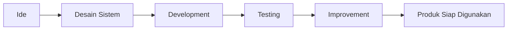

# 👨‍💻 Satria Farel Cipta Permata

### Web Developer • Problem Solver • Tech Enthusiast

Membangun solusi digital yang modern, responsif, dan bermanfaat.

---

# 🚀 Tentang Saya

Halo! Saya **Satria Farel Cipta Permata**, seorang **Web Developer** yang memiliki minat besar dalam membangun aplikasi web modern.

Saya menikmati proses mengubah **ide menjadi produk digital** yang dapat digunakan dan memberikan dampak nyata.

> *"Code is not just logic, it’s a way to build solutions."*

---

# 🧠 Tech Stack

---

# 📊 Skill Focus

---

# 📂 Proyek Pilihan

### 🌾 FoodStart

Website resep makanan khas Nusantara.

Tech:
HTML • CSS • JavaScript • Bootstrap

Fitur:

* Pencarian resep berdasarkan daerah
* Desain responsif
* Navigasi mudah

---

### 📋 DataSiswa

Sistem pendataan siswa untuk institusi pendidikan.

Tech:
PHP • MySQL • Bootstrap

Fitur:

* CRUD data siswa
* Manajemen data pendidikan
* Laporan data siswa

---

### 📜 Web Sertifikat

Platform untuk membuat dan mengelola sertifikat digital.

Tech:
PHP • HTML • CSS • dompdf

Fitur:

* Input data peserta
* Generate sertifikat otomatis
* Export PDF

---

### 🕌 JadwalShalatSF

Aplikasi jadwal shalat digital berbasis web.

Tech:
PHP • HTML • CSS • API waktu shalat

Fitur:

* Jadwal shalat sesuai lokasi
* Tampilan sederhana dan ringan
* Informasi waktu ibadah

---

### 🏘️ SIWarga

Sistem informasi warga berbasis web untuk administrasi RT.

Tech:
Laravel • MySQL • TailwindCSS

Fitur:

* Pengelolaan data warga
* Sistem iuran
* Informasi kegiatan RT

---

# 🌟 Filosofi Pengembangan

---

# 📊 GitHub Statistics

---

# 🤝 Hubungi Saya

📬 Email
[satriafarel40@gmail.com](mailto:satriafarel40@gmail.com)

---

⭐ Jika kamu tertarik dengan project saya, jangan ragu untuk memberi **star** pada repository yang kamu sukai!
