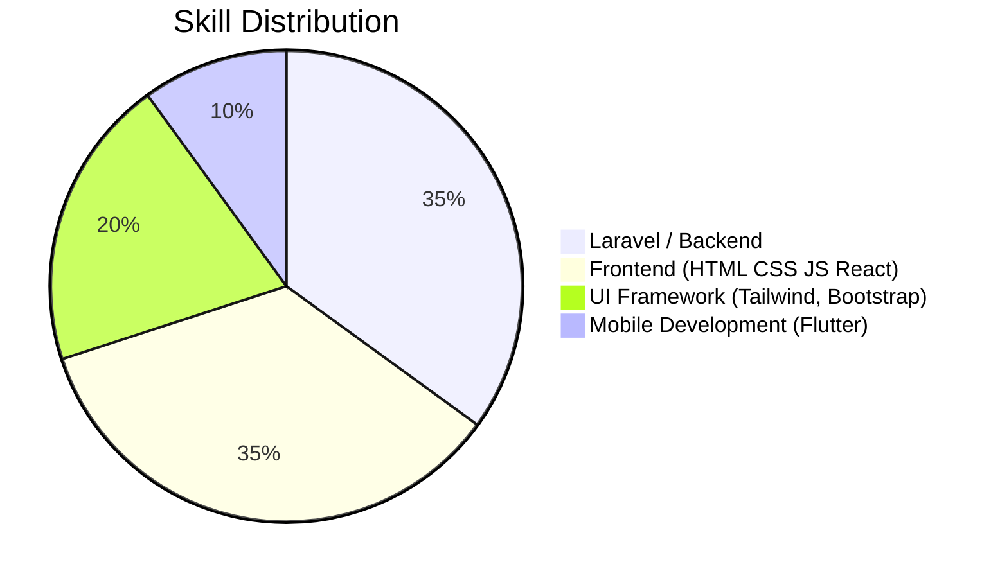
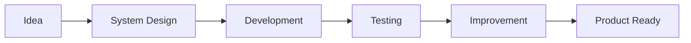

# 👨‍💻 Satria Farel Cipta Permata

### Web Developer • Problem Solver • Tech Enthusiast

Membangun solusi digital yang modern, responsif, dan bermanfaat.

---

# 🚀 Tentang Saya

Halo! Saya **Satria Farel Cipta Permata**, seorang **Web Developer** yang memiliki minat besar dalam membangun aplikasi web modern.

Saya menikmati proses mengubah **ide menjadi produk digital** yang dapat digunakan dan memberikan dampak nyata.

> *"Code is not just logic, it's a way to build solutions."*

---

# 🧠 Tech Stack

---

# 📊 Skill Focus

---

# 🚀 Highlight Projects

### 📚 BookPoint

Marketplace buku berbasis **React + Laravel + Tailwind** dengan sistem multi-role.

Fitur:

* Admin mengelola seller, customer, dan kategori
* Seller mengelola produk dan transaksi
* Customer melakukan pembelian dan chat dengan seller
* Sistem marketplace dengan dashboard terpisah

---

### 🚗 ParkirKu

Sistem manajemen parkir berbasis **Laravel + Tailwind**.

Fitur:

* Sistem member parkir berlangganan
* Parkir gratis untuk member aktif
* Non-member membayar berdasarkan durasi
* Dashboard admin dengan laporan parkir

---

### 📖 Buku Tamu Digital

Sistem buku tamu dengan **QR Code undangan**.

Fitur:

* Tamu umum input data saat datang
* Tamu khusus mendapatkan QR Code undangan
* Admin mengelola data tamu dan check-in

---

### 📜 Sistem Sertifikat Digital

Platform pengelolaan sertifikat berbasis web.

Fitur:

* Admin membuat sertifikat peserta
* Sertifikat dapat diunduh dalam format PDF
* Manajemen data peserta dan acara

---

# 🌟 Filosofi Pengembangan

---

# 📊 GitHub Statistics

---

# 🤝 Hubungi Saya

---

⭐ Jika kamu tertarik dengan project saya, jangan ragu untuk memberi **star** pada repository yang kamu sukai!
